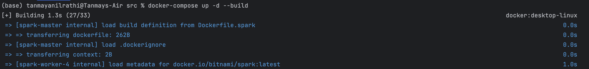
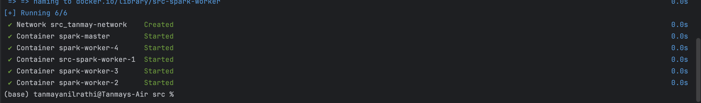
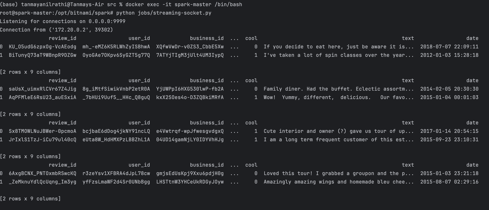
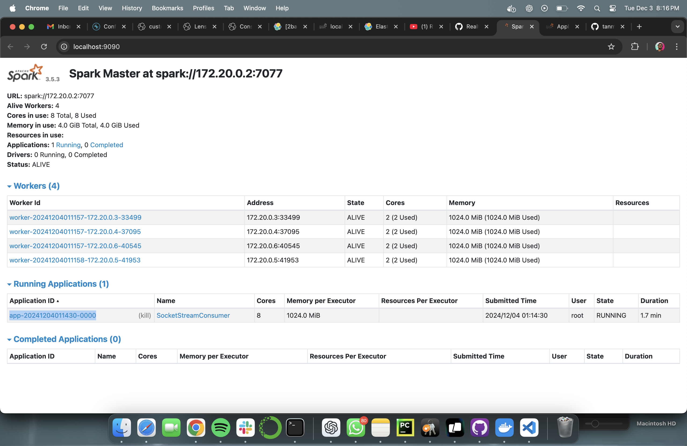
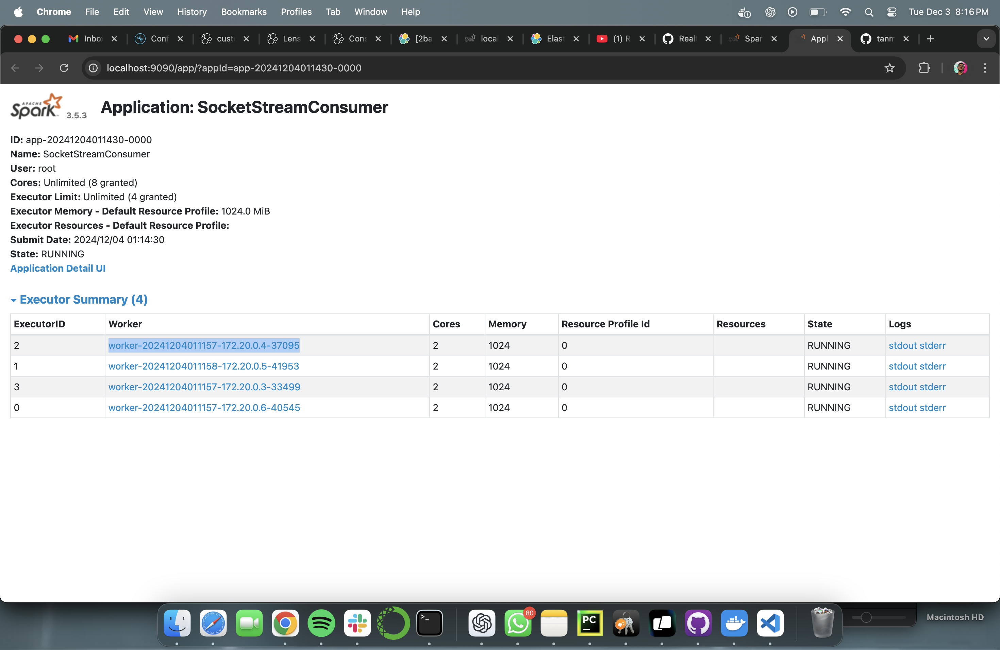
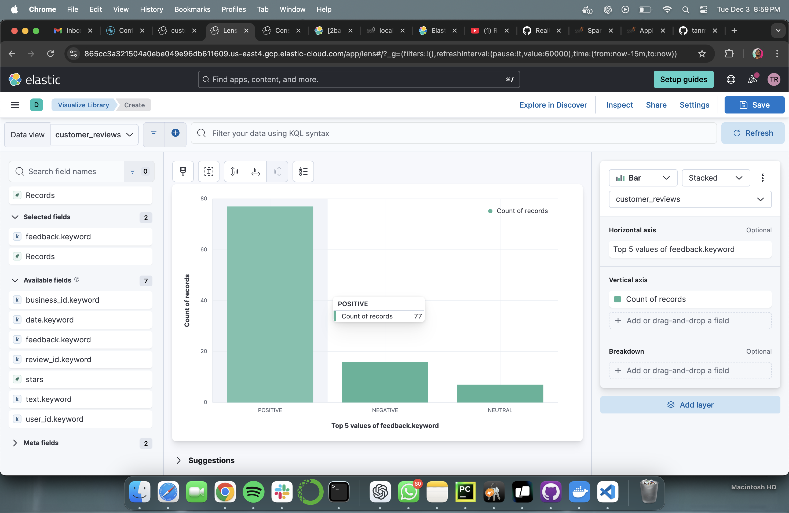
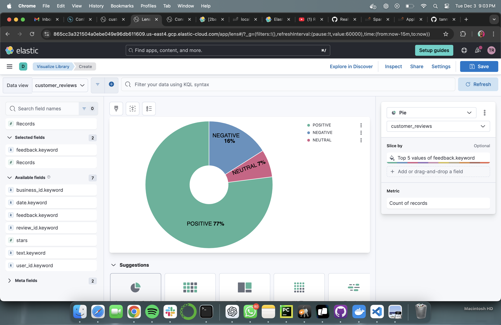
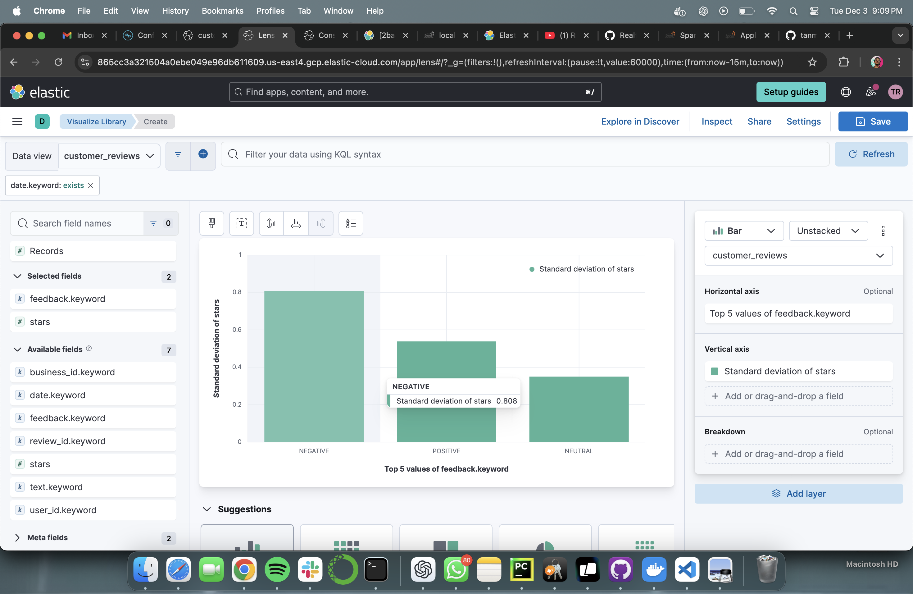

# Yelp Sentiment Analysis Streaming Project

## Introduction

This project demonstrates how to build an end-to-end data engineering pipeline that processes real-time streaming data. Using technologies like Apache Spark, OpenAI’s GPT models, Kafka, and Elasticsearch, the pipeline ingests Yelp reviews, performs sentiment analysis using OpenAI’s GPT models, and stores the results in Elasticsearch for querying and visualization.

---

## System Architecture

The architecture consists of:
1. **Data Source**: Yelp dataset streamed over TCP/IP socket.
2. **Apache Spark**: Processes incoming data and performs sentiment analysis.
3. **OpenAI LLM (ChatGPT)**: Provides sentiment analysis capabilities.
4. **Kafka**: Acts as a message broker for the processed data.
5. **Kafka Connect**: Connects Kafka to Elasticsearch.
6. **Elasticsearch**: Stores and indexes data for search and analysis.

---

## What You’ll Learn

- Setting up and running a Spark cluster using Docker.
- Streaming data over TCP/IP sockets.
- Integrating Apache Spark with OpenAI’s GPT models.
- Writing data to Kafka topics.
- Using Kafka Connect to sink data into Elasticsearch.
- Indexing and querying data in Elasticsearch.

---

## Technologies

- Python
- Apache Spark
- OpenAI GPT Models
- Apache Kafka
- Kafka Connect
- Elasticsearch
- Docker and Docker Compose

---

## Getting Started

### Prerequisites

- Docker and Docker Compose installed.
- Python 3 installed locally (if you wish to run scripts outside Docker).
- An OpenAI API Key.
- Access to a Kafka Cluster (e.g., Confluent Cloud).
- Access to an Elasticsearch instance (local or cloud-based).
- Yelp Dataset (or any dataset in the expected JSON format).

---

### Installation Steps

#### 1. Clone the Repository
```bash
git clone https://github.com/tanmayr71/yelpSentimentAnalysis_StreamingProject.git
cd yelpSentimentAnalysis_StreamingProject
```

#### 2. Set Up Configuration

Copy the example configuration file and fill in your details:
```bash
cp src/config/config.example.py src/config/config.py
```

Edit `src/config/config.py` with your API keys and Kafka configurations:
```python
config = {
    "openai": {
        "api_key": "YOUR_OPENAI_API_KEY"
    },
    "kafka": {
        "sasl.username": "YOUR_KAFKA_API_KEY",
        "sasl.password": "YOUR_KAFKA_API_SECRET",
        "bootstrap.servers": "YOUR_KAFKA_BOOTSTRAP_SERVER_URL:PORT",
        "security.protocol": "SASL_SSL",
        "sasl.mechanisms": "PLAIN",
        "session.timeout.ms": 50000
    },
    "schema_registry": {
        "url": "YOUR_SCHEMA_REGISTRY_URL",
        "basic.auth.user.info": "SR_API_KEY:SR_API_SECRET"
    }
}
```

#### 3. Add Your Dataset

Place your dataset file(s) in the `src/datasets/` directory. Ensure that your dataset is in JSON format and matches the expected schema.

By default, the `send_data_over_socket` function in `streaming-socket.py` is configured to use the dataset file located at:

```bash
send_data_over_socket("datasets/yelp_academic_dataset_review.json")
```

For testing purposes, we have included an additional test file configuration:

```bash
send_data_over_socket("datasets/yelp_dataset/test_yelp_academic_dataset_review.json")
```

You can replace the file path in the script with your own dataset file path as needed.

#### 4. Build and Start Docker Containers

Navigate to the `src/` directory and build the Docker containers:
```bash
cd src
docker-compose up -d --build
```



### Configuring Multiple Spark Workers

This project allows you to configure multiple Spark workers to distribute the workload effectively. By default, the docker-compose.yml is configured to start one master and one worker. However, you can easily provision additional workers based on your computational requirements.

To add more workers, update the docker-compose.yml file as follows:

```bash
spark-worker-2:
  <<: *worker
  container_name: spark-worker-2
  hostname: spark-worker-2

spark-worker-3:
  <<: *worker
  container_name: spark-worker-3
  hostname: spark-worker-3

spark-worker-4:
  <<: *worker
  container_name: spark-worker-4
  hostname: spark-worker-4
```



#### Notes on Worker Provisioning:
- You can provision as many workers as your system resources allow.Elasticsearch Sink Connector
- Each worker is configured to use `2 cores` and `1 GB` of memory by default. You can adjust these settings in the `docker-compose.yml` file under the `SPARK_WORKER_CORES` and `SPARK_WORKER_MEMORY` environment variables.
- Adding more workers enhances parallelism and reduces the processing time for large datasets or high-frequency streaming data.

---

## Running the Project

### 1. Start the Socket Server

Open a terminal and run the following command to start the socket server inside the Spark master container:
```bash
docker exec -it spark-master /bin/bash
```

Inside the container, start the socket server:
```bash
python jobs/streaming-socket.py
```

This script streams data from your dataset over a TCP socket.



---

### 2. Submit the Spark Streaming Job

In another terminal, submit the Spark streaming job that reads data from the socket, performs sentiment analysis, and writes to Kafka:
```bash
docker exec -it spark-master /bin/bash
```

Inside the container, run:
```bash
spark-submit \
--master spark://spark-master:7077 \
--packages org.apache.spark:spark-sql-kafka-0-10_2.12:3.5.0 \
jobs/spark-streaming.py
```

After the job submission, you can monitor the Spark Master UI at http://localhost:9090 to view the workers and the workload distribution across them. Below is an example of the Spark Master dashboard with four workers:

#### Spark Master with Multiple Workers



#### Application Running Across Workers




---

### 3. Set Up Kafka Connect Sink Connector

Set up a Kafka Connect sink connector to move data from your Kafka topic to Elasticsearch. If you’re using Confluent Cloud, you can use their UI to set up the connector.

#### Key Configurations:
- **Connector Class**: Elasticsearch Sink Connector
- **Topics**: `customers_review`
- **Elasticsearch Connection URL**: Your Elasticsearch endpoint
- **Additional Configurations**:
  - `key.ignore: true`
  - `schema.ignore: true`
  - `type.name: _doc` (for Elasticsearch 7.x and above)

In the `Confluent Cloud` dashboard, you can verify that your Kafka cluster (`review_cluster`) is running and view real-time statistics such as production and consumption rates for the `customers_review` topic:


Here’s how the Kafka environment and the `customers_review` topic look in `Confluent Cloud`:


### Monitor Connector Performance

You can monitor the performance of the `Kafka Elastic Search Sink Connector` in the `Confluent Cloud UI`. The dashboard provides insights into the number of messages processed and the status of the connector:


---

### 4. Verify Data in Elasticsearch

Once the connector is set up, data from Kafka will be indexed in Elasticsearch. You can verify this by querying Elasticsearch:
```bash
curl -u "<your-username>:<your-password>" -X GET "https://<your-elasticsearch-host>:443/customers_review/_search?pretty"
```

Below is the `Elasticsearch dashboard` showing the successfully indexed `customers_review` data:


You can see the documents indexed under the `customers_review` index and explore them in Elasticsearch or connect to visualization tools like `Tableau` or `Kibana` or `PowerBI`.

---

### 5. Optional: Visualize Data with Kibana or Tableau

Connect your Elasticsearch instance to Kibana or use tools like Tableau to create dashboards and visualize the sentiment analysis results.

---

### 6. Visualize Data Using ElasticSearch Dashboards

ElasticSearch provides built-in visualization tools that allow you to gain insights into the processed sentiment analysis data. Below are the examples of visualizations created using the indexed data in ElasticSearch:

#### Bar Graph: Count of Reviews per Sentiment Category
This bar graph shows the **count of reviews** classified into the categories `Positive`, `Negative`, and `Neutral`. The visualization helps to identify the distribution of sentiments across the dataset.



#### Pie Chart: Percentage of Reviews by Sentiment Category
A pie chart was created to represent the **percentage distribution** of reviews into the sentiment categories. This visualization provides a clear understanding of how reviews are split across sentiments.



#### Bar Graph: Standard Deviation of Stars by Sentiment
This bar graph displays the **standard deviation of star ratings** for reviews grouped by sentiment categories. It helps in analyzing the variability of star ratings for each sentiment type.



---

These visualizations provide a comprehensive understanding of the sentiment analysis results and their relationship with star ratings, allowing for effective data-driven insights.

## Directory Structure

```
├── README.md
├── assets
│   └── system_architecture.png
└── src
    ├── Dockerfile.spark
    ├── docker-compose.yml
    ├── requirements.txt
    ├── config
    │   ├── config.example.py
    │   └── config.py
    ├── datasets
    │   └── your_dataset.json
    ├── jobs
    │   ├── spark-streaming.py
    │   └── streaming-socket.py
    ├── schemas
    │   └── reviews.schema.avsc
    └── utils
        └── (optional utility scripts)
```

---

## Configuration Details

### `src/config/config.py`

This file contains all the necessary configuration for OpenAI API, Kafka, and Schema Registry.
- **openai.api_key**: Your OpenAI API key for accessing GPT models.
- **kafka.sasl.username**: Your Kafka API key.
- **kafka.sasl.password**: Your Kafka API secret.
- **kafka.bootstrap.servers**: Kafka bootstrap server URL and port.
- **schema_registry.url**: URL of your Schema Registry.
- **schema_registry.basic.auth.user.info**: Schema Registry API key and secret.

---

## Kafka Topic and Schema

- **Kafka Topic**: `customers_review`
- **Avro Schema**: Defined in `src/schemas/reviews.schema.avsc`.

---

## Docker Configuration

- **`docker-compose.yml`**: Defines services for spark-master and spark-worker.
- **`Dockerfile.spark`**: Extends the `bitnami/spark` image and installs additional Python packages.

---

## Troubleshooting

- **Connection Errors**: Ensure that your network configurations and hostnames are correct.
- **Docker Issues**: Check the `Dockerfile` and `docker-compose.yml` for misconfigurations.
- **OpenAI Rate Limits**: Be mindful of API rate limits and costs associated with OpenAI API usage.

---

## Contributing

Contributions are welcome! If you have suggestions or improvements, please create an issue or submit a pull request.

---

## License

This project is licensed under the MIT License - see the LICENSE file for details.

---

## Acknowledgements

- Thanks to OpenAI for providing the GPT models.
- Bitnami for the Dockerized Spark images.
- Confluent for Kafka and Schema Registry.
